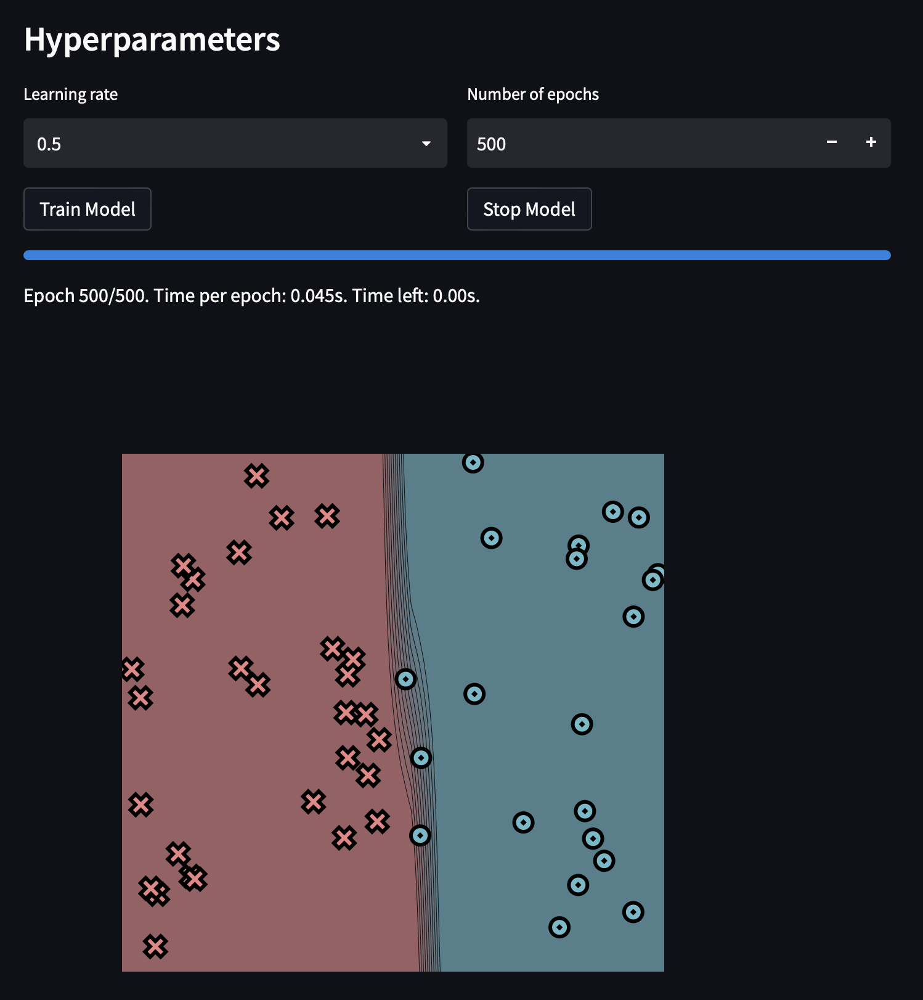
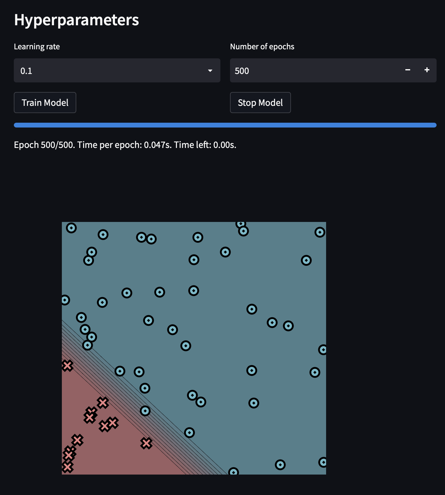
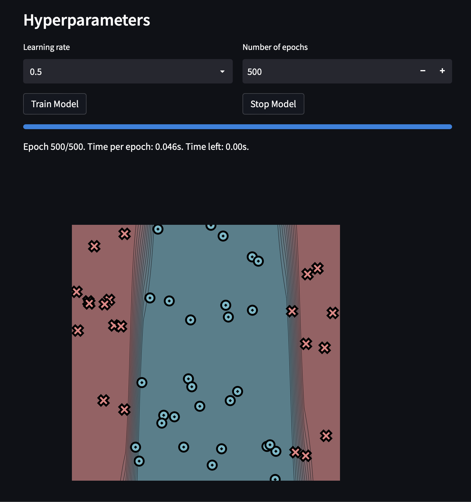
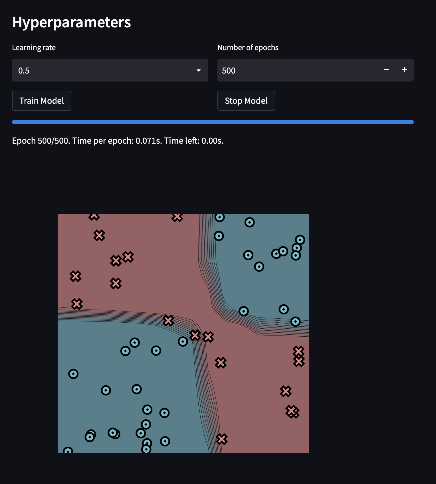
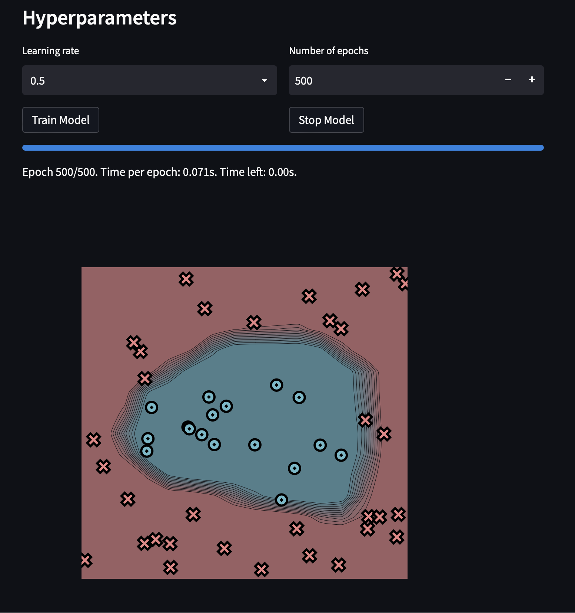

[](https://classroom.github.com/a/YFgwt0yY)
# MiniTorch Module 2


* Docs: https://minitorch.github.io/

* Overview: https://minitorch.github.io/module2/module2/

This assignment requires the following files from the previous assignments. You can get these by running

```bash
python sync_previous_module.py previous-module-dir current-module-dir
```

The files that will be synced are:

        minitorch/operators.py minitorch/module.py minitorch/autodiff.py minitorch/scalar.py minitorch/scalar_functions.py minitorch/module.py project/run_manual.py project/run_scalar.py project/datasets.py

## Module 2 Results

# Simple - Hidden Size, 5



Epochs:

Epoch: 0/500, loss: 0, correct: 0
Epoch: 10/500, loss: 26.959805127034873, correct: 29
Epoch: 20/500, loss: 19.532157785493112, correct: 44
Epoch: 30/500, loss: 12.610848662180988, correct: 47
Epoch: 40/500, loss: 9.745008919205272, correct: 47
Epoch: 50/500, loss: 7.883892937116136, correct: 49
Epoch: 60/500, loss: 6.650562723640056, correct: 49
Epoch: 70/500, loss: 5.767360795411533, correct: 49
Epoch: 80/500, loss: 7.084113284427557, correct: 47
Epoch: 90/500, loss: 13.87383424922834, correct: 44
Epoch: 100/500, loss: 4.486869202750231, correct: 49
Epoch: 110/500, loss: 3.8948209835154217, correct: 50
Epoch: 120/500, loss: 3.5234978372114183, correct: 50
Epoch: 130/500, loss: 3.2065281145853533, correct: 50
Epoch: 140/500, loss: 2.9434342532715205, correct: 50
Epoch: 150/500, loss: 2.9097758184615743, correct: 49
Epoch: 160/500, loss: 8.562115041393232, correct: 47
Epoch: 170/500, loss: 6.745425788975248, correct: 47
Epoch: 180/500, loss: 2.464479249228073, correct: 50
Epoch: 190/500, loss: 2.260277785534943, correct: 50
Epoch: 200/500, loss: 2.084232546658047, correct: 50
Epoch: 210/500, loss: 1.928335535032277, correct: 50
Epoch: 220/500, loss: 1.7899463955319963, correct: 50
Epoch: 230/500, loss: 1.666355535062321, correct: 50
Epoch: 240/500, loss: 1.5553445934035612, correct: 50
Epoch: 250/500, loss: 1.4558227930781509, correct: 50
Epoch: 260/500, loss: 1.365889637032931, correct: 50
Epoch: 270/500, loss: 1.2847513269964923, correct: 50
Epoch: 280/500, loss: 1.2110976014238444, correct: 50
Epoch: 290/500, loss: 1.1443406969201948, correct: 50
Epoch: 300/500, loss: 1.083327306615339, correct: 50
Epoch: 310/500, loss: 1.0277350029002141, correct: 50
Epoch: 320/500, loss: 0.9767858006907463, correct: 50
Epoch: 330/500, loss: 0.9301926086790422, correct: 50
Epoch: 340/500, loss: 0.8871239516863402, correct: 50
Epoch: 350/500, loss: 0.8474863756954144, correct: 50
Epoch: 360/500, loss: 0.8109300983729444, correct: 50
Epoch: 370/500, loss: 0.7769833324024178, correct: 50
Epoch: 380/500, loss: 0.7455092075321949, correct: 50
Epoch: 390/500, loss: 0.7162540715141755, correct: 50
Epoch: 400/500, loss: 0.6889861891306952, correct: 50
Epoch: 410/500, loss: 0.663528903030049, correct: 50
Epoch: 420/500, loss: 0.6397275218642019, correct: 50
Epoch: 430/500, loss: 0.6174469346232496, correct: 50
Epoch: 440/500, loss: 0.596502897674064, correct: 50
Epoch: 450/500, loss: 0.5768347907986696, correct: 50
Epoch: 460/500, loss: 0.5583731254935969, correct: 50
Epoch: 470/500, loss: 0.5409130883994866, correct: 50
Epoch: 480/500, loss: 0.5244447823290006, correct: 50
Epoch: 490/500, loss: 0.5088765507243688, correct: 50
Epoch: 500/500, loss: 0.49410008700782737, correct: 50

# Diag - Hidden Size, 5



Epochs:

Epoch: 0/500, loss: 0, correct: 0
Epoch: 10/500, loss: 34.85808987500962, correct: 42
Epoch: 20/500, loss: 31.60283987866402, correct: 42
Epoch: 30/500, loss: 29.902202560417603, correct: 42
Epoch: 40/500, loss: 28.906120011897706, correct: 42
Epoch: 50/500, loss: 28.284983846276397, correct: 42
Epoch: 60/500, loss: 27.877872558385047, correct: 42
Epoch: 70/500, loss: 27.596545677047853, correct: 42
Epoch: 80/500, loss: 27.388641998915197, correct: 42
Epoch: 90/500, loss: 27.222107345406837, correct: 42
Epoch: 100/500, loss: 27.07471081648079, correct: 42
Epoch: 110/500, loss: 26.932252521898743, correct: 42
Epoch: 120/500, loss: 26.782950701460074, correct: 42
Epoch: 130/500, loss: 26.61457363644175, correct: 42
Epoch: 140/500, loss: 26.40107305697872, correct: 42
Epoch: 150/500, loss: 26.124109144576394, correct: 42
Epoch: 160/500, loss: 25.781940481506822, correct: 42
Epoch: 170/500, loss: 25.39636502914041, correct: 42
Epoch: 180/500, loss: 24.955432392179308, correct: 42
Epoch: 190/500, loss: 24.43719811703292, correct: 42
Epoch: 200/500, loss: 23.838866269245678, correct: 42
Epoch: 210/500, loss: 23.141405279409902, correct: 42
Epoch: 220/500, loss: 22.358693639525264, correct: 42
Epoch: 230/500, loss: 21.48996188541314, correct: 42
Epoch: 240/500, loss: 20.541703844139466, correct: 42
Epoch: 250/500, loss: 19.50439750717423, correct: 43
Epoch: 260/500, loss: 18.391419755418262, correct: 46
Epoch: 270/500, loss: 17.255433800881125, correct: 46
Epoch: 280/500, loss: 16.124720009975263, correct: 46
Epoch: 290/500, loss: 15.009029059908308, correct: 49
Epoch: 300/500, loss: 13.878908796672674, correct: 50
Epoch: 310/500, loss: 12.74956452948752, correct: 51
Epoch: 320/500, loss: 11.650467838673459, correct: 51
Epoch: 330/500, loss: 10.303664883279072, correct: 52
Epoch: 340/500, loss: 8.930303936760712, correct: 52
Epoch: 350/500, loss: 7.951074426421961, correct: 53
Epoch: 360/500, loss: 7.1894893085558635, correct: 53
Epoch: 370/500, loss: 6.566878956671685, correct: 53
Epoch: 380/500, loss: 6.03469679646701, correct: 53
Epoch: 390/500, loss: 5.571810550254621, correct: 53
Epoch: 400/500, loss: 5.164362595312088, correct: 53
Epoch: 410/500, loss: 4.804383839386924, correct: 53
Epoch: 420/500, loss: 4.487846632452351, correct: 53
Epoch: 430/500, loss: 4.205322996319306, correct: 53
Epoch: 440/500, loss: 3.951025312330034, correct: 53
Epoch: 450/500, loss: 3.721030626666487, correct: 53
Epoch: 460/500, loss: 3.5121231349454094, correct: 53
Epoch: 470/500, loss: 3.3216027793100893, correct: 53
Epoch: 480/500, loss: 3.1472578988429407, correct: 53
Epoch: 490/500, loss: 2.987206449333782, correct: 53
Epoch: 500/500, loss: 2.8398653099161892, correct: 53

# Split  - Hidden Size, 5



Epoch: 0/500, loss: 0, correct: 0
Epoch: 10/500, loss: 34.61787724242174, correct: 26
Epoch: 20/500, loss: 34.132515130054884, correct: 29
Epoch: 30/500, loss: 34.052747057359205, correct: 29
Epoch: 40/500, loss: 34.010670774930716, correct: 29
Epoch: 50/500, loss: 33.9657849855375, correct: 29
Epoch: 60/500, loss: 33.930855822705944, correct: 29
Epoch: 70/500, loss: 33.890651817504086, correct: 29
Epoch: 80/500, loss: 33.84007541678589, correct: 29
Epoch: 90/500, loss: 33.77724453169896, correct: 29
Epoch: 100/500, loss: 33.69805608727849, correct: 29
Epoch: 110/500, loss: 33.59470169724657, correct: 29
Epoch: 120/500, loss: 33.46466689651651, correct: 29
Epoch: 130/500, loss: 33.296968748163934, correct: 29
Epoch: 140/500, loss: 33.09285174536313, correct: 29
Epoch: 150/500, loss: 32.8087520123186, correct: 30
Epoch: 160/500, loss: 32.40171055451059, correct: 33
Epoch: 170/500, loss: 31.8665483174975, correct: 32
Epoch: 180/500, loss: 31.130744545491268, correct: 36
Epoch: 190/500, loss: 30.05055895024741, correct: 37
Epoch: 200/500, loss: 28.116737245419827, correct: 42
Epoch: 210/500, loss: 25.11914936095392, correct: 44
Epoch: 220/500, loss: 23.27883095363006, correct: 43
Epoch: 230/500, loss: 22.2916423480165, correct: 43
Epoch: 240/500, loss: 20.37886432187414, correct: 43
Epoch: 250/500, loss: 19.808131193107098, correct: 41
Epoch: 260/500, loss: 15.736910895405819, correct: 43
Epoch: 270/500, loss: 17.82647803473389, correct: 40
Epoch: 280/500, loss: 15.12094229111309, correct: 42
Epoch: 290/500, loss: 14.421854453462728, correct: 42
Epoch: 300/500, loss: 13.627818564073243, correct: 42
Epoch: 310/500, loss: 12.451163086950258, correct: 44
Epoch: 320/500, loss: 11.199723785140714, correct: 44
Epoch: 330/500, loss: 8.841087043287246, correct: 47
Epoch: 340/500, loss: 7.157247410909011, correct: 50
Epoch: 350/500, loss: 4.844308665981325, correct: 50
Epoch: 360/500, loss: 3.9830017454022517, correct: 50
Epoch: 370/500, loss: 3.5523140061097425, correct: 50
Epoch: 380/500, loss: 3.2322674517029317, correct: 50
Epoch: 390/500, loss: 2.9569294829373503, correct: 50
Epoch: 400/500, loss: 2.716795203004043, correct: 50
Epoch: 410/500, loss: 2.506976718286244, correct: 50
Epoch: 420/500, loss: 2.343123839660336, correct: 50
Epoch: 430/500, loss: 2.1640280378357644, correct: 50
Epoch: 440/500, loss: 2.0230356318249663, correct: 50
Epoch: 450/500, loss: 1.8929647074384817, correct: 50
Epoch: 460/500, loss: 1.7820058386249717, correct: 50
Epoch: 470/500, loss: 1.6814679004495967, correct: 50
Epoch: 480/500, loss: 1.590013516301726, correct: 50
Epoch: 490/500, loss: 1.5065465918103924, correct: 50
Epoch: 500/500, loss: 1.4301414700404091, correct: 50

# XOR - Hidden Size, 7



Epoch: 0/500, loss: 0, correct: 0
Epoch: 10/500, loss: 26.61344371356625, correct: 39
Epoch: 20/500, loss: 23.937941888707737, correct: 39
Epoch: 30/500, loss: 20.538281943035262, correct: 43
Epoch: 40/500, loss: 18.720264090514696, correct: 42
Epoch: 50/500, loss: 14.571213689078451, correct: 48
Epoch: 60/500, loss: 12.340024289591383, correct: 48
Epoch: 70/500, loss: 11.360099482544861, correct: 48
Epoch: 80/500, loss: 11.738971538488924, correct: 47
Epoch: 90/500, loss: 10.18816236731458, correct: 48
Epoch: 100/500, loss: 8.143472972088224, correct: 48
Epoch: 110/500, loss: 7.524807734388837, correct: 48
Epoch: 120/500, loss: 6.851229740653088, correct: 48
Epoch: 130/500, loss: 6.263975784919438, correct: 48
Epoch: 140/500, loss: 5.661777765604092, correct: 48
Epoch: 150/500, loss: 5.05373587781335, correct: 50
Epoch: 160/500, loss: 4.584402461809, correct: 50
Epoch: 170/500, loss: 4.143810245410553, correct: 50
Epoch: 180/500, loss: 3.743920433772176, correct: 50
Epoch: 190/500, loss: 3.4783378806894976, correct: 50
Epoch: 200/500, loss: 3.0790064147970115, correct: 50
Epoch: 210/500, loss: 2.8906388363079643, correct: 50
Epoch: 220/500, loss: 2.6076309804236173, correct: 50
Epoch: 230/500, loss: 2.463389310542913, correct: 50
Epoch: 240/500, loss: 2.2511129604246563, correct: 50
Epoch: 250/500, loss: 2.0424083752466022, correct: 50
Epoch: 260/500, loss: 1.894366376459225, correct: 50
Epoch: 270/500, loss: 1.7910230677605796, correct: 50
Epoch: 280/500, loss: 1.694510489931864, correct: 50
Epoch: 290/500, loss: 1.6037084438363263, correct: 50
Epoch: 300/500, loss: 1.527290641178051, correct: 50
Epoch: 310/500, loss: 1.4484035133568047, correct: 50
Epoch: 320/500, loss: 1.387167629804141, correct: 50
Epoch: 330/500, loss: 1.3225305094776463, correct: 50
Epoch: 340/500, loss: 1.2675981060493275, correct: 50
Epoch: 350/500, loss: 1.2210296903996856, correct: 50
Epoch: 360/500, loss: 1.17600930361175, correct: 50
Epoch: 370/500, loss: 1.1274165971044148, correct: 50
Epoch: 380/500, loss: 1.1069594428611735, correct: 50
Epoch: 390/500, loss: 1.0549136575739548, correct: 50
Epoch: 400/500, loss: 1.0158405882368626, correct: 50
Epoch: 410/500, loss: 0.9839773442677927, correct: 50
Epoch: 420/500, loss: 0.9684323097764126, correct: 50
Epoch: 430/500, loss: 0.9266244167981775, correct: 50
Epoch: 440/500, loss: 0.9052346753283225, correct: 50
Epoch: 450/500, loss: 0.8840347765973325, correct: 50
Epoch: 460/500, loss: 0.8492185529304689, correct: 50
Epoch: 470/500, loss: 0.8418081315795019, correct: 50
Epoch: 480/500, loss: 0.8258826334626705, correct: 50
Epoch: 490/500, loss: 0.7904717048784589, correct: 50
Epoch: 500/500, loss: 0.7698253698892429, correct: 50

# Circle - Hidden Size, 7



Epoch: 0/500, loss: 0, correct: 0
Epoch: 10/500, loss: 28.71542788359836, correct: 33
Epoch: 20/500, loss: 27.873068264524743, correct: 33
Epoch: 30/500, loss: 26.86424667312374, correct: 33
Epoch: 40/500, loss: 26.31018695347292, correct: 40
Epoch: 50/500, loss: 24.855408296961606, correct: 47
Epoch: 60/500, loss: 24.3742220784759, correct: 45
Epoch: 70/500, loss: 27.28582450471696, correct: 38
Epoch: 80/500, loss: 18.272675464004585, correct: 46
Epoch: 90/500, loss: 16.115929211185037, correct: 47
Epoch: 100/500, loss: 15.839761286982228, correct: 45
Epoch: 110/500, loss: 18.83688834559506, correct: 44
Epoch: 120/500, loss: 12.147952595621101, correct: 44
Epoch: 130/500, loss: 10.261552326009685, correct: 47
Epoch: 140/500, loss: 14.13952621979446, correct: 45
Epoch: 150/500, loss: 8.181489250887912, correct: 48
Epoch: 160/500, loss: 7.056856146707427, correct: 49
Epoch: 170/500, loss: 40.28183951472669, correct: 34
Epoch: 180/500, loss: 6.703545286799741, correct: 48
Epoch: 190/500, loss: 5.550288345165422, correct: 49
Epoch: 200/500, loss: 16.26137854015117, correct: 41
Epoch: 210/500, loss: 7.959977447389624, correct: 46
Epoch: 220/500, loss: 4.151307863232272, correct: 50
Epoch: 230/500, loss: 4.140835425772346, correct: 50
Epoch: 240/500, loss: 4.473972681056553, correct: 49
Epoch: 250/500, loss: 4.653103259581522, correct: 49
Epoch: 260/500, loss: 3.6366985302643235, correct: 49
Epoch: 270/500, loss: 2.6444682508752733, correct: 50
Epoch: 280/500, loss: 2.331441488246567, correct: 50
Epoch: 290/500, loss: 2.1934575754119225, correct: 50
Epoch: 300/500, loss: 2.0649768294075006, correct: 50
Epoch: 310/500, loss: 1.9488075819539947, correct: 50
Epoch: 320/500, loss: 1.8458370595792926, correct: 50
Epoch: 330/500, loss: 1.751549702794962, correct: 50
Epoch: 340/500, loss: 1.6837226309813087, correct: 50
Epoch: 350/500, loss: 1.6032007771589503, correct: 50
Epoch: 360/500, loss: 1.4944422579708814, correct: 50
Epoch: 370/500, loss: 1.4441263743728012, correct: 50
Epoch: 380/500, loss: 1.384526881501553, correct: 50
Epoch: 390/500, loss: 1.286451391575829, correct: 50
Epoch: 400/500, loss: 1.2370838849587449, correct: 50
Epoch: 410/500, loss: 1.1582110399328773, correct: 50
Epoch: 420/500, loss: 1.1127757622873717, correct: 50
Epoch: 430/500, loss: 1.065866391695484, correct: 50
Epoch: 440/500, loss: 1.012184432713155, correct: 50
Epoch: 450/500, loss: 0.9620334521176256, correct: 50
Epoch: 460/500, loss: 0.9280122181369669, correct: 50
Epoch: 470/500, loss: 0.8968227687599873, correct: 50
Epoch: 480/500, loss: 0.857900218080178, correct: 50
Epoch: 490/500, loss: 0.8280483247549127, correct: 50
Epoch: 500/500, loss: 0.8014899535859225, correct: 50

# Spiral

